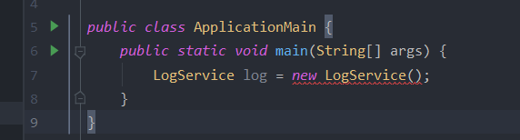
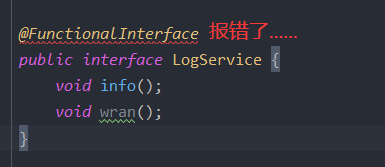

# 函数式接口

函数式接口是1.8中的新特性，他不属于新语法，更像是一种规范

## 面向对象接口复习

在这里先回顾一下面向对象的接口，创建接口的关键字为`interface`，这里创建一个日志接口：

```java
public interface LogService {
    void info();
}
```

众所周知，Java中的接口是不能直接创建实例的，因为他的抽象方法没有得到实现：



当我们想要创建接口实例的时候一般都通过实现类来获取实例：

```java
public class LogServiceImpl implements LogService {
    @Override
    public void info() {
        System.out.println("哈哈哈哈");
    }
}
```

这样我们就可以通过实现来创建这个接口的实例：

```java
public class ApplicationMain {
    public static void main(String[] args) {
        LogService log = new LogServiceImpl();
        log.info();
    }
}
```

对接口中的方法进行实现除了实现类之外，还可以通过匿名内部类的方式来创建接口的实例：

```java
public class ApplicationMain {
    public static void main(String[] args) {
        LogService log = new LogService() {
            @Override
            public void info() {
                System.out.println("嘿嘿嘿");
            }
        };
    }
}
```

## 什么是函数式接口

*当一个接口只有一个抽象方法 ( 接口默认实现不算 ) 的时候这个接口就是函数式接口*，上面的`LogService`就属于函数式接口，还有学习线程时的`Runnable`接口也属于函数式接口

函数式接口还有一个注解为`@FunctionalInterface`，据我了解这个注解可有可无，它主要起到的是检查的作用，当接口中的抽象方法数量大于1的时候就会报错：



## 内置常用函数式接口

Java中内置了一些常用的函数式接口，这里介绍其中的四种，不用刻意去记，用到就明白了

| 函数式接口     | 参数 | 返回值  | 说明                       |
| -------------- | ---- | ------- | -------------------------- |
| Consumer<T>    | T    | void    | 对类型为T的实例进行操作    |
| Supplier<T>    | 无   | T       | 返回类型为T的实例          |
| Function<T, R> | T    | R       | 通过对T的操作返回R的实例   |
| Predicate<T>   | T    | boolean | 通过对T的操作返回boolean值 |

通过巧妙的运用函数式接口可以实现回调函数的功能

# Lambda表达式

Lambda表达式是1.8中的新特性，*主要针对函数式接口的匿名内部类实现做了简化*

## 表达式基本语法

找到上面匿名内部类创建`LogService`的代码：

```java
public class ApplicationMain {
    public static void main(String[] args) {
        LogService log = new LogService() {
            @Override
            public void info() {
                System.out.println("嘿嘿嘿");
            }
        };
    }
}
```

因为创建的实例就是接口本身，所以`new`的部分就可以省略不写，接口中需要实现的抽象方法只有一个，那么也没有必要指定具体实现的方法名称，简写后如下所示：

```java
public class ApplicationMain {
    public static void main(String[] args) {
        LogService log = ()->{
            System.out.println("哈哈哈哈");
        };
        log.info();
    }
}
```

Lambda表达式前面的括号`( )`就代表参数列表，箭头`->`后面的代码块就代表着实现的具体方法体，如果`info`方法中有参数就可以这样写：

```java
public class ApplicationMain {
    public static void main(String[] args) {
        LogService log = (msg)->{
            System.out.println(msg);
        };
        log.info("老八秘制小汉堡");
    }
}
```

使用Lambda表达式创建一个线程：

```java
public class ApplicationMain {
    public static void main(String[] args) {
        // Runnable为函数式接口，所以可以使用Lambda表达式
        new Thread(()->{
            System.out.println("另一条线程");
        }).start();
        System.out.println("Main主线程");
    }
}
```

## 表达式的简写

使用Lambda表达式代替匿名内部类的写法非常简洁，但是在满足特定条件的情况下，它还可以更简洁：

```java
public class ApplicationMain {
    public static void main(String[] args) {
        /**
         * 在参数列表只有一个参数的情况下，()可以省略不写
         * 当代码块中只有一句代码时{}可以省略不写
         * 当函数有返回值且代码块中只有一句代码时return可以省略不写
         */
        LogService log = msg->System.out.println(msg);
        log.info("老八秘制小汉堡");
    }
}
```

Lambda表达式相比匿名内部类还有一个特点，当使用匿名内部类时会为匿名内部类生成一个class文件，而使用Lambda表达式时就不会额外生成class文件，这个不做重点

# 方法引用

方法引用是1.8中的新特性，配合Lambda表达式使用可以让代码更简洁

## 方法引用初体验

方法引用中需要的特殊符号为双冒号`::`，具体表现为以下形式：

| 表现形式       | 作用                       |
| -------------- | -------------------------- |
| 对象::实例方法 | 通过对象调用实例中的方法   |
| 类::实例方法   | 通过类调用实例中的方法     |
| 类::静态方法   | 通过类调用实例中的静态方法 |
| 类::new        | 创建该类的实例             |

*当Lambda表达式中只有一句函数调用代码，且调用的目标函数的参数列表和Lambda表达式接收的参数列表一致时就可以使用方法引用*，如下所示：

```java
public class ApplicationMain {
    public static void main(String[] args) {
        // 代表的就是上面表格中表现形式的第一行  对象::实例方法
        LogService log = System.out::println;
        log.info("老八秘制小汉堡");
        // forEach同样可以使用方法引用
        List<Integer> list = Arrays.asList(1, 2, 3, 4, 5);
        list.forEach(System.out::println);
    }
}
```

## 综合练习

针对上面的函数式接口，Lambda表达式以及方法引用做练习，代码会有些多：

```java
/**
 * 综合练习
 *   函数式接口 + Lambda表达式 + 方法引用
 */
public class ApplicationMain {

    public static void main(String[] args) {
        // 方法引用  对象::实例方法
        strToDate("2021-2-20 22:08:45", System.out::println);
        // 方法引用  类::new
        System.out.println(dateToStr(Date::new));
        // 回调函数：取最大值
        Integer integer = strListToIntList(Arrays.asList("135", "541", "244"), list -> {
            int maxNumber = 0;
            for (Integer item : list) {
                if (item > maxNumber) {
                    maxNumber = item;
                }
            }
            return maxNumber;
        });
        System.out.println("最大值为：" + integer);
        // 实现过滤器功能
        List<Integer> list = filter(Arrays.asList(800, 200, 1200, 600, 3000, 2400), item -> item > 1000);
        System.out.println(list);
    }

    // Consumer：通过时间字符串快速获取Date对象
    public static void strToDate(String date, Consumer<Date> consumer) {
        SimpleDateFormat sdf = new SimpleDateFormat("yyyy-MM-dd HH:mm:ss");
        Date parse = null;
        try {
            parse = sdf.parse(date);
        } catch (ParseException e) {
            System.err.println("转换失败！");
        }
        consumer.accept(parse);
    }

    // Supplier：通过Date对象快速获取到时间字符串
    public static String dateToStr(Supplier<Date> supplier) {
        Date date = supplier.get();
        SimpleDateFormat sdf = new SimpleDateFormat("yyyy-MM-dd HH:mm:ss");
        return sdf.format(date);
    }

    // Function：将String集合转换为Integer，后续操作交给调用者
    public static Integer strListToIntList(List<String> list, Function<List<Integer>, Integer> function) {
        ArrayList<Integer> integerList = new ArrayList<>();
        for (Iterator<String> iterator = list.iterator(); iterator.hasNext();) {
            String next = iterator.next();
            Integer integer = Integer.valueOf(next);
            integerList.add(integer);
        }
        return function.apply(integerList);
    }

    // predicate：返回大于1000的数字
    public static List<Integer> filter(List<Integer> list, Predicate<Integer> predicate) {
        ArrayList<Integer> target = new ArrayList<>();
        for (Integer item : list) {
            if (predicate.test(item)) {
                target.add(item);
            }
        }
        return target;
    }

}
```

# 流式编程

流式编程是1.8中的新特性，基于常用的四种函数式接口以及Lambda表达式对集合类数据进行类似流水线一般的操作

流式编程分为大概三个步骤：`获取流 → 操作流 → 返回操作结果`

## 流的获取方式

这里先了解获取流的常用的两种方式，后面在进行流的操作

> 集合中获取流

众所周知Java中所有的集合都是`Collection`下的实现类，在`Collection`接口中就提供了获取流的方法：

```java
public class ApplicationMain {
    public static void main(String[] args) {
        ArrayList<Integer> list = new ArrayList<>();
        // 获取流
        Stream<Integer> stream1 = list.stream();
        // 获取流(多线程，大数据量下效率较高)
        Stream<Integer> stream2 = list.parallelStream();
    }
}
```

> 数组中获取流

针对数组Java中提供了一个`Arrays`工具类，我们可以将数组转换为集合在获取流

```java
public class ApplicationMain {
    public static void main(String[] args) {
        Integer[] arr = {1, 2, 3, 4, 5};
        List<Integer> list = Arrays.asList(arr);
        Stream<Integer> stream1 = list.stream();
        Stream<Integer> stream2 = list.parallelStream();
    }
}
```

或者直接通过`Arrays`类获取到流

```java
public class ApplicationMain {
    public static void main(String[] args) {
        Integer[] arr = {1, 2, 3, 4, 5};
        Stream<Integer> stream = Arrays.stream(arr);
    }
}
```

> 流的获取方式 总结与补充

| 方法名                                                 | 说明                                                         |
| ------------------------------------------------------ | ------------------------------------------------------------ |
| Collection.stream()                                    | 从集合中获取流                                               |
| Collection.parallelStream()                            | 从集合中获取流 ( 多线程 )                                    |
| Arrays.stream(T[])                                     | 从数组中获取流                                               |
| Stream.of(T... values)                                 | 直接传入多个元素返回一个流                                   |
| Stream.generate(Supplier<T> s)                         | Lambda返回的每个实例都是流中的一个元素                       |
| Stream iterate(final T seed, final UnaryOperator<T> f) | Lambda接收参数一个参数，返回一个结果作为元素，每次返回的结果都将作为下一个Lambda的参数 ( 迭代 ) |

## 操作流中的数据

### 假数据模拟

知道了如何获取到流之后，就要开始学习操作流了，在练习之间先写一个假的接口来模拟数据：

```java
// 接口模拟数据
public class UserService {
    public List<UserEntity> selectList() {
        ArrayList<UserEntity> list = new ArrayList<>();
        list.add(new UserEntity("老八", 32, '男', 8000));
        list.add(new UserEntity("郭老师", 36, '女', 7000));
        list.add(new UserEntity("卢本伟", 32, '男', 18000));
        list.add(new UserEntity("张春德", 22, '男', 2800));
        list.add(new UserEntity("大司马", 34, '男', 12000));
        list.add(new UserEntity("老八", 32, '男', 8000));
        list.add(new UserEntity("贾玲", 22, '女', 21000));
        list.add(new UserEntity("周淑怡", 26, '女', 14800));
        list.add(new UserEntity("PDD", 37, '男', 26300));
        return list;
    }
}
```

```java
// UserEntity实体类
public class UserEntity {

    private String name;
    private int age;
    private char gender;
    private int salary;

    public UserEntity(){}
    public UserEntity(String name, int age, char gender, int salary) {
        this.name = name;
        this.age = age;
        this.gender = gender;
        this.salary = salary;
    }

    public String getName() {
        return name;
    }
    public void setName(String name) {
        this.name = name;
    }
    public int getAge() {
        return age;
    }
    public void setAge(int age) {
        this.age = age;
    }
    public char getGender() {
        return gender;
    }
    public void setGender(char gender) {
        this.gender = gender;
    }
    public int getSalary() {
        return salary;
    }
    public void setSalary(int salary) {
        this.salary = salary;
    }

    @Override
    public boolean equals(Object o) {
        if (this == o) return true;
        if (o == null || getClass() != o.getClass()) return false;
        UserEntity that = (UserEntity) o;
        return getAge() == that.getAge() &&
                getGender() == that.getGender() &&
                getSalary() == that.getSalary() &&
                getName().equals(that.getName());
    }
    @Override
    public int hashCode() {
        return Objects.hash(getName(), getAge(), getGender(), getSalary());
    }

    @Override
    public String toString() {
        return "{" +
                "姓名='" + name + '\'' +
                ", 年龄=" + age +
                ", 性别=" + gender +
                ", 薪水=" + salary +
                '}';
    }
}
```

### 函数式接口复习

在操作流式编程之前先来复习一下函数式接口，这里以实现集合的过滤器为例：

```java
public class ApplicationMain {

    public static void main(String[] args) {
        UserService userService = new UserService();
        List<UserEntity> list = userService.selectList();
        // 获取所有女性员工
        ArrayList<UserEntity> result = filter(list, item -> item.getGender() == '女');
        result.forEach(System.out::println);
    }

    // 自定义集合过滤器
    public static ArrayList<UserEntity> filter(List<UserEntity> list, Predicate<UserEntity> predicate) {
        // 创建一个结果集
        ArrayList<UserEntity> result = new ArrayList<>();
        // 空值校验
        if (list == null || list.size()==0)
            return null;
        // 遍历传入的集合，根据调用者制定的过滤规则进行判断，符合条件就添加到结果集中
        for (UserEntity entity : list) {
            if (predicate.test(entity)) {
                result.add(entity);
            }
        }
        return result;
    }

}
```

这样我们就获取到了一个 ArrayList 集合的过滤器

### 操作流的方法

流式编程操作流非常类似上面的代码，常用函数如下所示：

| 方法名     | 说明                                                      |
| ---------- | --------------------------------------------------------- |
| filter()   | 循环集合中每个元素进行判断，返回false的元素会被过滤掉     |
| limit()    | 截取方法，传入 int 类型的 n，从第一个元素开始只获取 n 个  |
| skip()     | 跳过方法，传入 long 类型的 n，流将从第 n+1 个元素开始操作 |
| distinct() | 去重方法，去掉集合中重复的元素，只保留第一个              |
| sorted()   | 排序方法，通过判断返回的 boolean 值作为参考进行排序       |
| map()      | 这个方法比较特殊，后面用到会详细说明                      |

**使用流式编程需要了解他的特点：**

1. 我们通过流式编程操作集合是不会影响集合本身
2. 流式编程的代码都是延迟执行的，只有在获取结果的时候才会执行

> filter 过滤方法

```java
// 获取到薪水大于10000的所有用户
public class ApplicationMain {
    public static void main(String[] args) {
        UserService userService = new UserService();
        List<UserEntity> list = userService.selectList();
        list.stream()
                .filter(item->item.getSalary()>10000)
                .forEach(System.out::println);
    }
}
```

> limit 截取方法

```java
// 只获取结果中的5条数据(从首个开始截取)
public class ApplicationMain {
    public static void main(String[] args) {
        UserService userService = new UserService();
        List<UserEntity> list = userService.selectList();
        list.stream()
                .limit(5)
                .forEach(System.out::println);
    }
}
```

> skip 跳过方法

```java
// 这里就跳过了2个元素，从"卢本伟"开始操作
public class ApplicationMain {
    public static void main(String[] args) {
        UserService userService = new UserService();
        List<UserEntity> list = userService.selectList();
        list.stream()
                .skip(2)
                .forEach(System.out::println);
    }
}
```

> distinct：去重方法

这里需要提一嘴，**使用`distinct`方法操作的实体类必须复写`equals`和`hashCode`方法**

```java
// 去重操作，可以看到两个老八只剩下一个
public class ApplicationMain {
    public static void main(String[] args) {
        UserService userService = new UserService();
        List<UserEntity> list = userService.selectList();
        list.stream()
                .distinct()
                .forEach(System.out::println);
    }
}
```

> sorted ：排序方法

```java
// 通过薪水对集合进行排序
public class ApplicationMain {
    public static void main(String[] args) {
        UserService userService = new UserService();
        List<UserEntity> list = userService.selectList();
        list.stream()
                // 排序需要传入一个Comparator比较器，这里通过Integer直接获取
                // 通过调换item1和item2的顺序实现升序降序的调整
                .sorted((item1, item2)->Integer.compare(item1.getSalary(), item2.getSalary()))
                .forEach(System.out::println);
    }
}
```

> map：生成新的数据

`map`同之前那几个稍微有些区别，类似`filter`或者`sorted`方法都是对集合进行编辑，而`map`可以将集合改变为一组新的数据：

```java
// 通过map返回每个用户的姓名，将用户集合改变成了用户姓名集合
public class ApplicationMain {
    public static void main(String[] args) {
        UserService userService = new UserService();
        List<UserEntity> list = userService.selectList();
        list.stream()
                .map(UserEntity::getName)
                .forEach(System.out::println);
    }
}
```

## 返回操作结果

返回操作结果是流式编程最后一步，也是最关键的一步，之前说过流式编程操作集合不会影响集合本身，那么想要获取结果就需要进行这最后一步，需要注意的是*流式编程只有在返回操作结果的时候才会执行操作代码*

之前使用的`forEach`就属于返回结果的代码，如果只调用了`filter`方法而没有调用返回结果，那么`filter`方法是不会执行的，可以使用下面这段代码进行测试

```java
// 代码正常执行，如果将forEach移除就会发现filter中的打印语句同样没有执行
public class ApplicationMain {
    public static void main(String[] args) {
        UserService userService = new UserService();
        List<UserEntity> list = userService.selectList();
        list.stream()
                .filter(item->{
                    System.out.println("过滤代码执行了");
                    return item.getSalary() > 10000;
                }).forEach(System.out::println);
    }
}
```

常用获取结果的方法

| 方法名    | 作用                 |
| --------- | -------------------- |
| forEach() | 对流中的数据进行遍历 |
| min()     | 传入比较器获取最小值 |
| max()     | 传入比较器获取最大值 |
| count()   | 计算最终结果的数量   |
| collect() | 将操作结果转换为集合 |

> forEach：循环遍历

```java
// forEach是最简单的循环遍历，没什么好说的
public class ApplicationMain {
    public static void main(String[] args) {
        UserService userService = new UserService();
        List<UserEntity> list = userService.selectList();
        list.stream()
                .filter(item->item.getSalary() > 10000)
                .forEach(System.out::println);
    }
}
```

> min：取最小值

```java
public class ApplicationMain {
    public static void main(String[] args) {
        UserService userService = new UserService();
        List<UserEntity> list = userService.selectList();
        UserEntity entity = list.stream()
                .filter(item -> item.getSalary() > 10000)
                // 获取最小值需要传入Comparator比较器，直接从Comparator中取出Int类型比较器
                .mim(Comparator.comparingInt(UserEntity::getSalary))
                // 这里并不会直接返回实体类，需要在get一下才能获取到
                .get();
        System.out.println(entity);
    }
}
```

> max：取最大值

```java
public class ApplicationMain {
    public static void main(String[] args) {
        UserService userService = new UserService();
        List<UserEntity> list = userService.selectList();
        UserEntity entity = list.stream()
                .filter(item -> item.getSalary() > 10000)
                // max同min一致
                .max(Comparator.comparingInt(UserEntity::getSalary))
                .get();
        System.out.println(entity);
    }
}
```

> count：对结果进行计数

```java
// 获取月薪大于10000的人数
public class ApplicationMain {
    public static void main(String[] args) {
        UserService userService = new UserService();
        List<UserEntity> list = userService.selectList();
        long count = list.stream()
                .filter(item -> item.getSalary() > 10000)
                .count();
        System.out.println(count);
    }
}
```

> collect：返回操作结果

```java
public class ApplicationMain {
    public static void main(String[] args) {
        UserService userService = new UserService();
        List<UserEntity> list = userService.selectList();
        List<UserEntity> collect = list.stream()
                .filter(item -> item.getSalary() > 10000)
                // 直接调用collect方法，然后调用toList将结果转换为List集合
                .collect(Collectors.toList());
        System.out.println(collect);
    }
}
```

## 流式编程综合练习

```java
// 流式编程+链式编程
public class ApplicationMain {
    public static void main(String[] args) {
        UserService userService = new UserService();
        List<UserEntity> list = userService.selectList();
        List<String> result = list.stream()
                // 找到所有男性员工
                .filter(item->item.getGender()=='男')
                // 去除重复数据
                .distinct()
                // 按照年龄进行排序
                .sorted(Comparator.comparingInt(UserEntity::getAge))
                // 获取他们所有人的名字
                .map(UserEntity::getName)
                // 最后转换为List集合
                .collect(Collectors.toList());
        // 打印查看效果
        System.out.println(result);
    }
}
```
