# RabbitMQ ????

???? RabbitMQ ????? MQ ??????MQ(????) ???????????????????????? ( ??????? )?????? Controller ????????? Service?????????????????????????? Service ??????????????????? Service ???????????????????

??????????????RocketMQ?ActiveMQ?RabbitMQ?Kafka.... ?????? `RabbitMQ`

????? ( Windows 7 ) ??? RabbitMQ 3.8.9??????? RabbitMQ ? rabbit

## RabbitMQ ???

rabbit ??? erlang ??????????????????? rabbit ??????? erlang ???

### Windows ??

????????????`otp_win64_23.1.exe` ? `rabbitmq-server-3.8.9.exe`

> ?? erlang

??????????? opt ???????????????????????????????????????? `ERLANG_HOME` ??? path ??? bin ???? JDK ?????????

>?? RabbitMQ

???? rabbit ????????????????????????????? `RabbitMQ` ???????????????? rabbit ???????

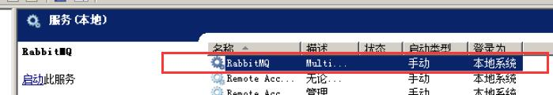

?? windows ??????? `net start ..` `net stop ..` ????? rabbit ????????????????????????????????? rabbit

? rabbit ????????????? rabbit ?????? sbin ???? `rabbitmq-server.bat` ????????????????? rabbit ?????

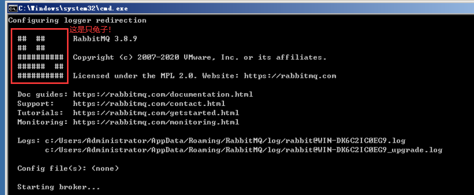

?? bat ???? rabbit?cmd ????? rabbit ???????????? rabbit?? tomcat ??

### CentOS ??

???????????????????????[?????CentOS7??RabbitMQ](https://www.cnblogs.com/fengyumeng/p/11133924.html)

> rabbit ??????

```shell
# ??RabbitMQ
rabbitmq-server
# ????RabbitMQ
rabbitmq-server -detached
# ????
rabbitmqctl stop
# ??RabbitMQ????
rabbitmqctl status
# ??
rabbitmqctl help
```

## RabbitMQ ??????

???? rabbit ?????? sbin ????????????? `rabbitmqctl.bat` ????????????? rabbit ???????????????????????? rabbit ?????????

1. ?? `RABBIT_HOME` ????? rabbit ??????
2. ? `path` ???? `sbin` ??

### ??????

???????? `help` ??????????????????????

```cmd
C:\Users\Administrator>rabbitmqctl help

# ??????????????
Users: # Users??????????

   add_user                      Creates a new user in the internal database
   authenticate_user             Attempts to authenticate a user. Exits with ......
   change_password               Changes the user password
   clear_password                Clears (resets) password and disables password .....
   delete_user                   Removes a user from the internal database ......
   list_users                    List user names and tags
   set_user_tags                 Sets user tags

Virtual hosts: # Virtual????????????

   add_vhost                     Creates a virtual host
   clear_vhost_limits            Clears virtual host limits
   delete_vhost                  Deletes a virtual host
   list_vhost_limits             Displays configured virtual host limits
   restart_vhost                 Restarts a failed vhost data stores and queues
   set_vhost_limits              Sets virtual host limits
   trace_off
   trace_on
   
Access Control:

   clear_permissions             Revokes user permissions for a vhost
   clear_topic_permissions       Clears user topic permissions for a vhost ......
   list_permissions              Lists user permissions in a virtual host
   list_topic_permissions        Lists topic permissions in a virtual host
   list_user_permissions         Lists permissions of a user across all virtual hosts
   list_user_topic_permissions   Lists user topic permissions
   list_vhosts                   Lists virtual hosts
   set_permissions               Sets user permissions for a vhost
   set_topic_permissions         Sets user topic permissions for an exchange
```

????????????? `add_user ????`?`list_user ??????`?`add_vhost ??????`????????????????????????

```cmd
# ??????(??guest?????????guest????administrator)
C:\Users\Administrator>rabbitmqctl list_users
Listing users ...
user    tags
guest   [administrator]
# ????zhang????hanzhe
C:\Users\Administrator>rabbitmqctl add_user zhang hanzhe
Adding user "zhang" ...
# ???zhang??administrator??
C:\Users\Administrator>rabbitmqctl set_user_tags zhang administrator
Setting tags for user "zhang" to [administrator] ...
# ??????/push
C:\Users\Administrator>rabbitmqctl add_vhost /push
Adding vhost "/push" ...
# ?????????????
C:\Users\Administrator>rabbitmqctl set_permissions -p /push zhang '.' '.' '.'
Setting permissions for user "zhang" in vhost "/push" ...
```

??????????????????? `zhang`?? `hanzhe` ???????? `/push` ????

### ????&????

> ????????

????????????? help ?????????????????WEB????????????????? rabbit ? web ?????

WEB ????? rabbit ?????? ( plugins )?????????????????? sbin ????????????? `rabbitmq-plugins.bat` ????????????????????

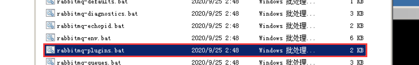

???????? help ???????

```cmd
Help:

   autocomplete  Provides command name autocomplete variants
   help          Displays usage information for a command
   version       Displays CLI tools version

Monitoring, observability and health checks:

   directories   Displays plugin directory and enabled plugin file paths
   is_enabled    Health check that exits with a non-zero code if provided ......

Plugin Management:

   disable       Disables one or more plugins
   enable        Enables one or more plugins
   list          Lists plugins and their state
   set           Enables one or more plugins, disables the rest
```

???? `list` ???????????`enable` ? `disable` ???????????

> ????????

???????????? `rabbitmq_management`?

```cmd
C:\Users\Administrator>rabbitmq-plugins enable rabbitmq_management
Enabling plugins on node rabbit@WIN-DK6C2IC0EG9:
rabbitmq_management
The following plugins have been configured:
    rabbitmq_management
    rabbitmq_management_agent
    rabbitmq_web_dispatch
Applying plugin configuration to rabbit@WIN-DK6C2IC0EG9...
Plugin configuration unchanged.
```

???????????? WEB ??????? `http://localhost:15672/` ??????????????


????????????? rabbit ?????? guest ???????????? zhang ???????????????????? **guest ??????**???????????????????????? linux ???? rabbit ????????????????

?????????????????????


?????????????????????????????????

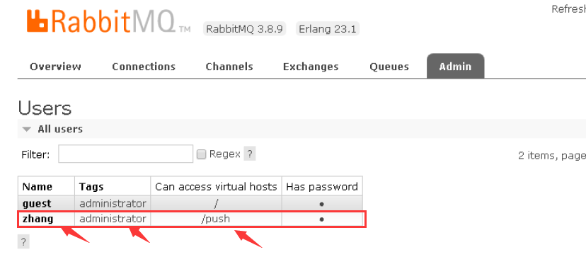

> ??????

- rabbitmq_web_stomp rabbitmq_stomp rabbitmq_web_stomp_examples
  - ?????????????????? websocket ?? rabbit ??
- rabbitmq_mqtt rabbitmq_web_mqtt
  - ?????????????????????????????? mqtt ????

## RabbitMQ ???

> ?? Maven ??

????????? maven ????? rabbit ??????? maven ??

```xml
<dependency>
    <groupId>com.rabbitmq</groupId>
    <artifactId>amqp-client</artifactId>
    <version>5.10.0</version>
</dependency>
```

> ??????

??????????????????????????????????????????????????????????????????????????????????????????

```java
// ?????????????????
public class Provider1 {
    public static void main(String[] args) throws Exception {
        // ????????
        ConnectionFactory factory = new ConnectionFactory();
        // ?????????
        factory.setUsername("zhang");     // ???
        factory.setPassword("hanzhe");    // ??
        factory.setHost("192.168.1.147"); // ????
        factory.setPort(5672);            // ???
        factory.setVirtualHost("/push");  // ??????
        // ????????
        Connection conn = factory.newConnection();
        // ????????????????????????????????
        Channel channel = conn.createChannel();
        // ???????????????Rabbit?????????????????????
        String queueName = "queue-1"; // ????
        boolean durable = false;      // ?????
        boolean exclusive = false;    // ????????
        boolean autoDelete = true;    // ??????
        // ????
        channel.queueDeclare(queueName, durable, exclusive, autoDelete, null);
        // ????
        String message = "??????";
        channel.basicPublish("", queueName, null, message.getBytes());
    }
}
```

?????????????

- ???? `queueDeclare` ??????
  - `queueName?` ?????????????????????????? `Queues` ????????
  - `durable?` ???????????????????????? rabbitm ?????????????????*???????????????????????????????????????*
  - `exclusive?` ??????????????????? `queue-1` ???? `conn` ??????????????? true ???????????????
  - `autoDelete?` ???????????????????????????????????????????????
  - ???????? `map` ??????????????????? ( ?????? )
- ???? `basicPublish` ???????
  - ???????????????????????????????**??? null**??????
  - ??????????????????????????
  - ???????????????????????????????
  - ??????????????????????????????? `getBytes` ??

?????????????????????????

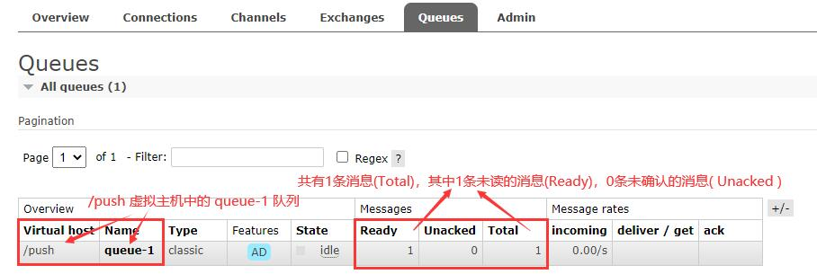

???????????????????? `Connections` ? `Channels` ???????????????????????????

```java
public class Provider1 {
    public static void main(String[] args) throws Exception {
        ......
        channel.close();
  conn.close();
    }
}
```

> ??????

?????????? queue-1 ????????????????????

```java
public class Consumer1 {
    public static void main(String[] args) throws Exception {
        // ???????
        ConnectionFactory factory = new ConnectionFactory();
        factory.setUsername("zhang");     // ???
        factory.setPassword("hanzhe");    // ??
        factory.setHost("192.168.1.147"); // ????
        factory.setPort(5672);            // ???
        factory.setVirtualHost("/push");  // ??????
        Connection conn = factory.newConnection();
        Channel channel = conn.createChannel();
        // ??????????????????????????????
        String queueName = "queue-1";
        boolean autoAck = true;
        // ???????????
        channel.basicConsume(queueName, autoAck, new DefaultConsumer(channel){
            @Override
            public void handleDelivery(
                    String consumerTag,
                    Envelope envelope,
                    AMQP.BasicProperties properties,
                    byte[] body) throws IOException {
                System.out.println("??????? " + new String(body));
            }
        });
        // ??
        channel.close();
        conn.close();
    }
}
```

?????????????

- ???? `basicConsume` ????
  - `queueName?` ?????????
  - `autoAck?` ??????????? true ????
  - `DefaultConsumer?` ?????????????? `DefaultConsumer` ???? `handleDelivery` ???????????? ( ???? ) ??????????

??????

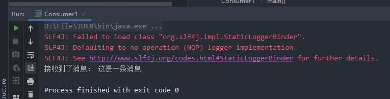

> ????? ( ?????????? )

?????????????????????????????????????????????????????????????????

```java
public class RabbitMQ {

    private static final String URL = "192.168.1.108";
    private static final int PORT = 5672;
    private static final String VIRTUAL = "/push";
    private static final String USERNAME = "zhang";
    private static final String PASSWORD = "hanzhe";

    // ????
    public static Connection getConnection(){
        ConnectionFactory factory = new ConnectionFactory();
        factory.setHost(URL);
        factory.setPort(PORT);
        factory.setVirtualHost(VIRTUAL);
        factory.setUsername(USERNAME);
        factory.setPassword(PASSWORD);
        Connection conn = null;
        try {
            conn = factory.newConnection();
        } catch (Exception e) {
            e.printStackTrace();
        }
        return conn;
    }

    // ?????????
    public static Channel getChannel(Connection conn){
        Channel channel = null;
        try {
            channel = conn.createChannel();
        } catch (IOException e) {
            e.printStackTrace();
        }
        return channel;
    }

    // ??
    public static void close(Channel channel) {
        // ???????????????
        Connection conn = channel.getConnection();
        try {
            channel.close();
            conn.close();
        } catch (Exception e) {
            System.err.println("?????");
            e.printStackTrace();
        }
    }

}
```

## ??????

> ????????

????????????????????????????????????????????????????????????????????????????????????

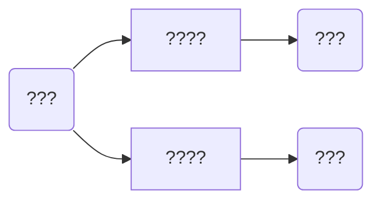

??????????????????????????????????? **??? ( exchange )**????????????????????????????????????????

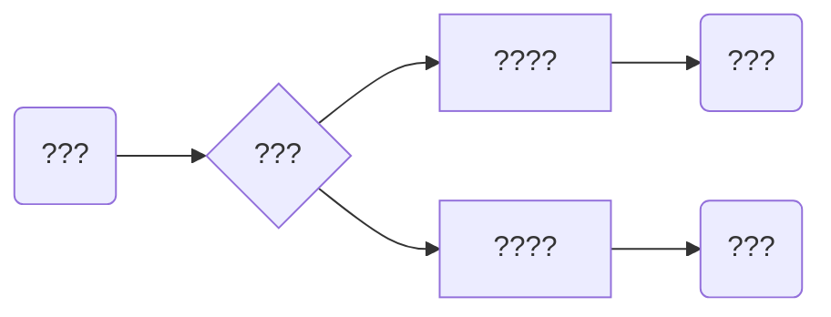

?????????????????????????????????????rabbit ????????????????????????????  **??**?**??**?**??**

### ?????

> ?????????

????? ( **fanout** ) ???? *????????????*???????????????????

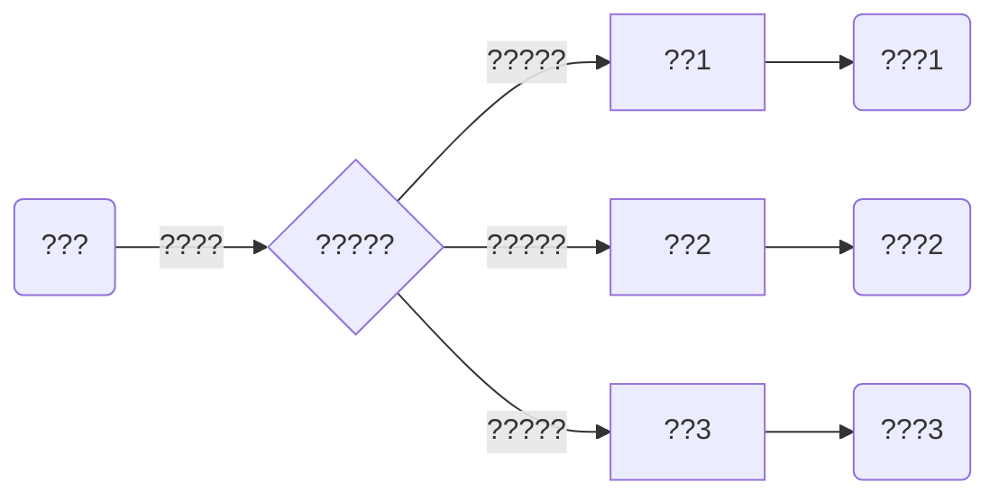

> ????????

???????????? `DefaultConsumer` ?????????????????????????????????????????????????????????

```java
// ???DefaultConsumer??
public class Consumer extends DefaultConsumer {

    private String consumerName;

    // ????????????????????
    public Consumer(String consumerName, Channel channel) {
        super(channel);
        this.consumerName = consumerName;
    }

    @Override
    public void handleDelivery(String consumerTag,
            Envelope envelope,
            AMQP.BasicProperties properties,
            byte[] body) throws IOException {
        System.out.println(this.consumerName + "? " + new String(body));
    }

}
```

> ??????

?????????????????????

```java
// ????
public class Consumer2 {

    public static void main(String[] args) throws IOException {
        Channel channel = RabbitMQ.getChannel(RabbitMQ.getConnection());
        // ???????????????????????
        String queueName = "queue-";
        for (int i = 1; i <= 3; i++) {
            String name = queueName + i;
            channel.queueDeclare(name, false, false, false, null);
            channel.basicConsume(name, true, new Consumer("???" + i, channel));
        }
        // ?????????????????????????????
    }

}
```

> ??????

??????????????????????????????????????

```java
// ?????????????????
public class Provider2 {
    public static void main(String[] args) throws Exception {
        Connection conn = RabbitMQ.getConnection();
        Channel channel = RabbitMQ.getChannel(conn);
        // ?????   ????????????  ???????????
        String exchangeName = "exchange-1-fanout";
        String type = "fanout";
        channel.exchangeDeclare(exchangeName, type);
        // ?????????????????????????????????
        channel.queueBind("queue-1", exchangeName, "");
        channel.queueBind("queue-2", exchangeName, "");
        channel.queueBind("queue-3", exchangeName, "");
        // ????????????????????????????????????????
        channel.basicPublish(exchangeName, "", null, "123".getBytes());
        RabbitMQ.close(channel);
    }
}
```

?????????????

- `queueBind` ??????????????????????????????????????????????????????? `queueBind("queue-1", exchangeName, "")` ???????? `queue-1` ????? `exchangeName` ????
- ??????????????????????????????? null ?????

> ?????

????????????????????????????? ( ??????????????????????? ) ????????????????????????????? **??????????**

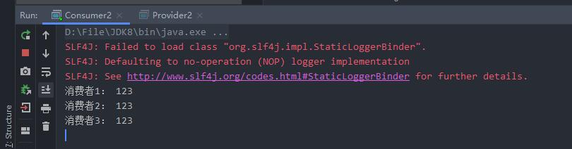

### ?????

????? ( **direct** ) ???? **????????? *??* ??????????**??????????????????? `routingKey` ?????

???? `Fanout` ??????????????????????????????????????????????????????????????????????????????????????????????????

~~~mermaid
graph LR
A(???) -->|key:k2|B{?????} 
   B -->|key:k1|C[??A] -->D(???1)
   B -->|key:k2|E[??B] -->|?????????|F(???2)
            B -->|key:k3|G[??C] -->H(???3)
~~~

> ?????

```java
public class Consumer3 {
    public static void main(String[] args) throws IOException {
        // ???????????????????????????????????????
        Channel channel = RabbitMQ.getChannel(RabbitMQ.getConnection());
        for (int i = 1; i <= 3; i++) {
            String queueName = "queue-" + i;
            channel.basicConsume(queueName, true, new Consumer("???" + i, channel));
        }
    }
}
```

> ?????

```java
public class Provider3 {
    public static void main(String[] args) throws Exception {
        Channel channel = RabbitMQ.getChannel(RabbitMQ.getConnection());
        // ???????????????
        String exchangeName = "exchange-2-direct";
        String type = "direct";
        channel.exchangeDeclare(exchangeName, type);
        // ???????????????????????routingKey
        channel.queueBind("queue-1", exchangeName, "k1");
        channel.queueBind("queue-2", exchangeName, "k2");
        channel.queueBind("queue-3", exchangeName, "k3");
        // ???????????????????????????????????????
        channel.basicPublish(exchangeName, "k1", null, "??".getBytes());
        channel.basicPublish(exchangeName, "k2", null, "??".getBytes());
        channel.basicPublish(exchangeName, "k3", null, "??".getBytes());
        RabbitMQ.close(channel);
    }
}
```

> ?????

??????????????????????????????????????

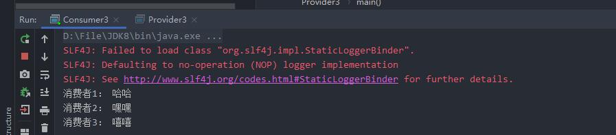

????????? `routingKey` ????????????????????????????????????? `routingKey`???????????????????????????????? `routingKey` ????????????????????????

### ?????

????? ( **topic** )??????????????????????????????? `RoutingKey` ????????????????????????????? `RoutingKey` ?????

**???????????**

- routingkey ???? `.` ???????????
- `*`??????????????
- `#`?????????????? ( 0 ~ ??? ) ???

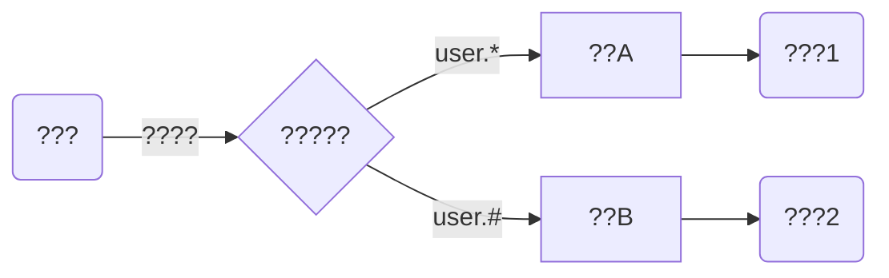

????????????????????????? `RoutingKey` ?????????

- `routingkey = user.insert`??????????????????
- `routingkey = user.insert.ok`??? B ?????A ?????????????????????
- `routingkey = user`?A ?????????????????????????? B ???? ( 0 ~ ? )

> ??????

????????????????????????????????? `routingKey` ???

```java
// ???
public class Provider4 {
    public static void main(String[] args) throws Exception {
        Channel channel = RabbitMQ.getChannel(RabbitMQ.getConnection());
        // ???????????????
        String exchangeName = "exchange-3-topic";
        String type = "topic";
        channel.exchangeDeclare(exchangeName, type);
        // ???????????????????????????????
        channel.queueBind("queue-1", exchangeName, "user.*");
        channel.queueBind("queue-2", exchangeName, "user.#");
        // ????????????????????????????????????????
        channel.basicPublish(exchangeName, "user.insert", null, "??".getBytes());
        channel.basicPublish(exchangeName, "user.insert.ok", null, "??".getBytes());
        channel.basicPublish(exchangeName, "user", null, "??".getBytes());
        RabbitMQ.close(channel);
    }
}
```

> ????

????????????????????1?????????????2????????

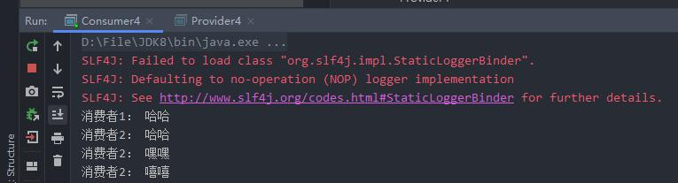

???????????????? `RoutingKey` ???????????????????????????????????????????????????????????????

### ??????????

????????????????????????????????????????????????????????**rabbit ????????????**???????????? `Exchanges` ??????

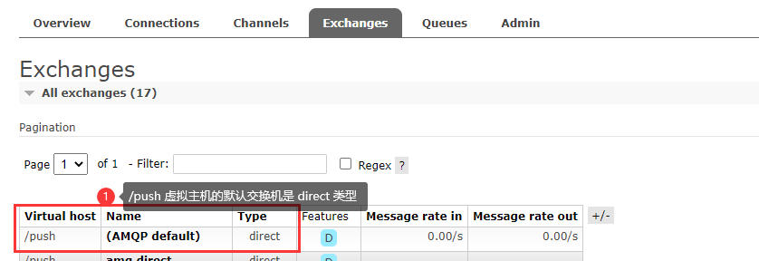

???????? `basicPublish` ????????????????????????????

????????????????????????????????????????????????? A ????????????????? B ???????????????????

> ?????? ( ?? ) ????????

```java
// ?????
public class ConsumerExample {
    public static void main(String[] args) throws IOException {
        Channel channel = RabbitMQ.getChannel(RabbitMQ.getConnection());
        // ?????????????????????????????????????????
        channel.basicQos(1);
        channel.basicConsume("queue-1", true, new Consumer("???1", channel));
        channel.basicConsume("queue-1", true, new Consumer("???2", channel));
    }
}
```

## ????

### ??????

??????????????????? rabbit ??????????? rabbit ????????????????????????????????????????????????????????????????? ( ?????? .... ) ????????????????? rabbit ???????????????????????**????**????????????????????????

???????????? ( ?????? ) ?


```java
// ?????
public class ConsumerExample {
    public static void main(String[] args) throws IOException {
        Channel channel = RabbitMQ.getChannel(RabbitMQ.getConnection());
        // ?????????false
        boolean autoAck = false;
        channel.basicConsume("queue-1", autoAck, new Consumer("???", channel));
    }
}
```

????????????????????????????????????


?????????????????? `Unacked` ?????????????????????????????????????????????????????????????????????????????????????????????????????????????????????

```java
// ?????
public class Consumer5 extends DefaultConsumer {

    public Consumer5(Channel channel) {
        super(channel);
    }

    public static void main(String[] args) throws IOException {
        Channel channel = RabbitMQ.getChannel(RabbitMQ.getConnection());
        channel.basicConsume("queue-1", false, new Consumer5(channel));
    }

    @Override
    public void handleDelivery(
            String consumerTag,
            Envelope envelope,
            AMQP.BasicProperties properties,
            byte[] body) throws IOException {
        // ?????????
        // service.xxx
        // ???????
        super.getChannel().basicAck(envelope.getDeliveryTag(), false);
    }
}
```

### ??????

???????????????????????????????????????????

> ?????????

```java
public class Demo1 {
    public static void main(String[] args) throws Exception{
        Channel channel = RabbitMQ.getChannel(RabbitMQ.getConnection());
        // ?????????????DeclareOk??????????????????
        AMQP.Queue.DeclareOk declare =
                channel.queueDeclare("z-queue", false, false, true, null);
        // ??????
        String queueName = declare.getQueue();
        // ????????
        int consumerCount = declare.getConsumerCount();
        // ???????
        int messageCount = declare.getMessageCount();
    }
}
```

> ???????????

```java
public class GetQueueInfo {
    public static void main(String[] args) throws Exception{
        Channel channel = RabbitMQ.getChannel(RabbitMQ.getConnection());
        // ??????????DeclareOk??
        AMQP.Queue.DeclareOk declare = channel.queueDeclarePassive("z-queue");
        System.out.println(declare.getQueue());
        System.out.println(declare.getConsumerCount());
        System.out.println(declare.getMessageCount());
        RabbitMQ.close(channel);
    }
}
```

### ??????

> ????????

**1.**????????????????? null???????????????? **????** ???????

```java
public class QueueTimeout {
    public static void main(String[] args) throws Exception{
        Channel channel = RabbitMQ.getChannel(RabbitMQ.getConnection());
        Map<String, Object> settings = new HashMap<>();
        // ????????ms?????????????????????
        settings.put("x-message-ttl", 10 * 1000);
        channel.queueDeclare("queue-timeout-1", false, false, true, settings);
        channel.basicPublish("", "queue-timeout-1", null, "123".getBytes());
        RabbitMQ.close(channel);
    }
}
```

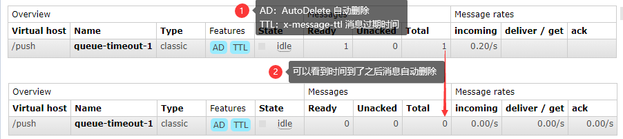

**2.**?????????????????????????????????

```java
public class QueueTimeout2 {
    public static void main(String[] args) throws Exception{
        Channel channel = RabbitMQ.getChannel(RabbitMQ.getConnection());
        Map<String, Object> settings = new HashMap<>();
        // ???????????ms????????????
        settings.put("x-expires", 10 * 1000);
        channel.queueDeclare("queue-timeout-1", false, false, true, settings);
        RabbitMQ.close(channel);
    }
}
```

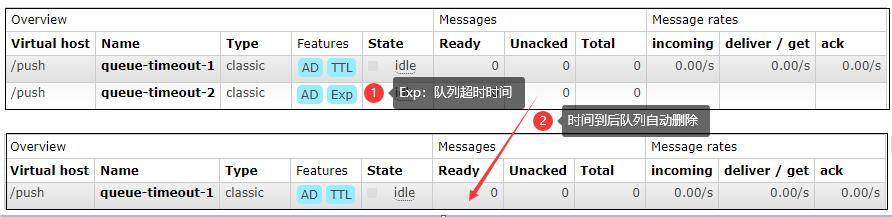

> ?????????

??????????????????????????????????

```java
public class QueueTimeout3 {

    public static void main(String[] args) throws Exception{
        Channel channel = RabbitMQ.getChannel(RabbitMQ.getConnection());
        String queueName = "queue-timeout-3";
        channel.queueDeclare(queueName, false, false, true, null);
        channel.basicPublish("", queueName, getProp(10), "123".getBytes());
        channel.basicPublish("", queueName, getProp(60), "456".getBytes());
        RabbitMQ.close(channel);
    }

    // ??????
    public static AMQP.BasicProperties getProp(int second){
        return new AMQP.BasicProperties.Builder()
             // ????????ms
                .expiration(Long.toString((second * 1000)))
                .build();
    }

}
```

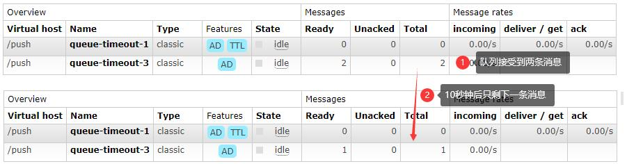

???????????????????????????????? `Get Message(s)` ?????????

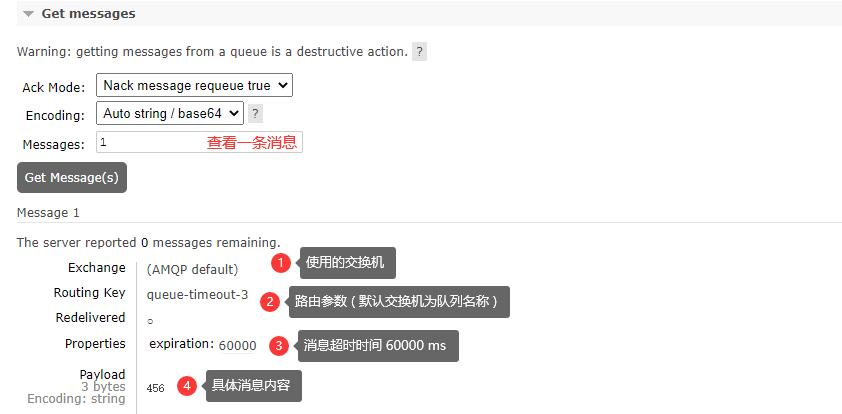

## ???? RabbitMQ

### WebSocket + StompJS

> ?JS??

```html
<!DOCTYPE html>
<html lang="ch">

<head>
    <meta charset="UTF-8">
    <title>RabbitMQ</title>
    <!-- ?????JS?? -->
    <script src="https://cdn.bootcss.com/stomp.js/2.3.3/stomp.js"></script>
    <script src="https://cdn.bootcss.com/sockjs-client/1.1.4/sockjs.js"></script>
</head>

<body></body>

<script type="text/javascript">
    // ???ws??
    let url = "192.168.1.108";
    let ws = new WebSocket(`ws://${url}:15672/ws`);

    // ??Stomp client??
    let client = Stomp.over(ws);

    // ??RabbitMQ
    let username = "zhang";
    let password = "hanzhe";
    let virtual = "/push";
    client.connect(username, password, success, error, virtual);

    // ??????????
    function success(x) {
        let queue = "queue-1"
        // console.log("x", x);
        client.subscribe(`/queue/${queue}`, function (res) {
            console.log(`???????? ${res.body}`);
        });
    };

    // ?????????
    function error(e) {
        console.log("error", e);
    };

</script>

</html>
```

**??????**???? `ws` ????????? socket ???????? `Stomp` ????????????
